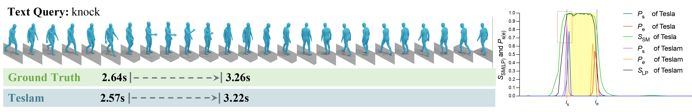
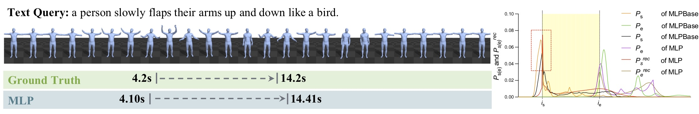

# MLP: Motion Label Prior for Temporal Sentence Localization in Untrimmed 3D Human Motions

## Description
Official PyTorch implementation of the paper [**"MLP: Motion Label Prior for Temporal Sentence Localization in Untrimmed 3D Human Motions"**](https://arxiv.org/abs/2404.13657)(TCSVT 2024).




## Installation

<!-- <details><summary>Click to expand</summary> -->

### 1. Create conda environment

<!-- <details><summary>Instructions</summary> -->

```bash
conda create --name mlp python=3.7
conda activate mlp
```

Install [PyTorch 1.13](https://pytorch.org/) inside the conda environment, and install the following packages:

```bash
conda install ipykernel
pip install matplotlib
pip install tqdm
pip install scipy h5py coloredlogs 
pip install omegaconf
pip install hydra-core
pip install seaborn
pip install peft
pip install einops
pip install tensorboard tensorboardX tensorboard_logger
pip install orjson
```
The code was tested on Python 3.7 and PyTorch 1.13.

</details>

### 2. Download the datasets

<!-- <details><summary>Instructions</summary> -->

#### Motion representation

Thanks to [HumanML3D](https://github.com/EricGuo5513/HumanML3D), we adopt the same method to extract the joint information representation of both the BABEL/HumanML3D (Restore) dataset. Please follow the instructions of the ``raw_pose_processing.ipynb`` of the [HumanML3D](https://github.com/EricGuo5513/HumanML3D) repo, to get the ``pose_data`` folder. During this process, you need to download the corresponding [AMASS](https://amass.is.tue.mpg.de/) data set according to the prompts. It may take up to 2 days to complete the entire data processing.
After above, copy or symlink the pose_data folder in ``datasets/motions/``:
```bash
ln -s /path/to/HumanML3D/pose_data datasets/motions/pose_data
```

Then, we take scripts in [TMR](https://github.com/Mathux/TMR) to compute the HumanML3D Guo features on the whole AMASS (+HumanAct12) dataset. Run the following command:

```bash
python -m prepare.compute_guoh3dfeats
```

It should process the features (+ mirrored version) and saved them in ``datasets/motions/guoh3dfeats``. These features are common in TSLM because the annotation sources of BABEL and HumanML3D (Restore) datasets are from it.

#### Get motion-text annotations

##### BABEL dataset
> :exclamation: We cannot directly provide original data files to abide by the license.


Visit https://babel.is.tue.mpg.de/ to download BABEL dataset. At the time of experiment, we used ``babel_v1.0_release`` . BABEL dataset should be loacated at datasets/babel/babel_v1.0_release . File structures under ``datasets/babel/babel_v1.0_release`` looks like:
```
.
├── extra_train.json
├── extra_val.json
├── test.json
├── train.json
└── val.json
```

In order to follow the unified specification of AMASS annotations, we used [AMASS-Annotation-Unifier](https://github.com/Mathux/AMASS-Annotation-Unifier) to post-process these annotation data to obtain ``babel.json`` and ``babel_extra.json``. The entire pipeline is embedded in this project. Please run the following command:
```bash
python prepare/babel_aau.py
```

##### HumanML3D (Restore) dataset

We are very grateful to the original [HumanML3D](https://github.com/EricGuo5513/HumanML3D) for directly open-sourcing the annotation data. Here, we have provided the annotation data that conforms to the unified annotation specification of AMASS. Please see the file ``datasets/human3d/humanml3d.json`` for the new HumanML3D (Restore) dataset. This is the final valid version. As for the production process, please refer to the description in our paper.

Overall, the legal ``datasets`` folder structure is as follows:

```
datasets
├── babel
│   ├── babel_extra.json
│   ├── babel.json
│   └── splits
│       ├── test_extra.txt
│       ├── test.txt
│       ├── train_extra.txt
│       └── train.txt
├── humanml3d
│   ├── humanml3d.json
│   └── splits
│       ├── all.txt
│       ├── test.txt
│       ├── train.txt
│       └── val.txt
└── motions
│   ├── posedata
│   │   ├── ...
│   └── guoh3dfeats
│       ├── ...
```

<!-- </details> -->

### 3. Download text model dependencies

<!-- <details><summary>Instructions</summary> -->

#### Download Roberta and MPNet from __Hugging Face__
```bash
cd deps/
git lfs install
git clone https://huggingface.co/roberta-base
git clone https://huggingface.co/sentence-transformers/all-mpnet-base-v2
cd ..
```


Make sure you have ``git-lfs`` installed on your device. The above steps are not absolute and can also be downloaded via huggingface-cli. The Roberta is used as a word embedding extractor, and MPNet calculates the similarity between texts and is used to measure false-negative moments.

<!-- </details> -->
<!-- </details> -->

## How to train MLP

<!-- <details><summary>Click to expand</summary> -->

The command to start MLP training is as follows:
```bash
# train MLP on BABEL dataset
python train.py model=mlp data=babel model.beta=0.1
# train MLP on HumanML3D (Restore) dataset
python train.py model=mlp data=humanml3d model.beta=0.2
```
You can modify the model parameters in the 'config/model/mlp.yaml' file. When running for the first time, the ``.h5`` file of the model input will be automatically generated, which may take 2-4 hours.

Similarly, to train MLPBase, please use the following command: 

```bash
# train MLPBase on BABEL dataset
python train.py model=mlpbase data=babel
# train MLPbase on HumanML3D (Restore) dataset
python train.py model=mlpbase data=humanml3d
```

<!-- </details> -->

## Evaluating MLP

<!-- <details><summary>Click to expand</summary> -->

Use the following command to evaluate mlp:
```bash
python eval.py folder=FOLER
```

The ```FOLDER``` can be replaced with the main experiment, such as ```outputs/babel/batchsize64/mlp/2024-02-29_17-34-36```. After the evaluation, some visual results will be automatically generated in the 'FOLDER/qualitative' folder and top-5 'FOLDER/mlp/prediction' results in the prediction folder.

<!-- </details> -->


## Citation
If you find this code to be useful for your research, please consider citing.
```
@article{yan2024mlp,
  title={MLP: Motion Label Prior for Temporal Sentence Localization in Untrimmed 3D Human Motions},
  author={Yan, Sheng and Liu, Mengyuan and Wang, Yong and Liu, Yang and Liu, Hong},
  journal={IEEE Transactions on Circuits and Systems for Video Technology},
  year={2024},
  publisher={IEEE}
}
```

## Acknowledgments

This code is standing on the shoulders of giants. We want to thank the following contributors that our code is based on:

[VSLNet](https://github.com/26hzhang/VSLNet), [LGI](https://github.com/JonghwanMun/LGI4temporalgrounding), [HumanML3D](https://github.com/EricGuo5513/HumanML3D)

## License

This code is distributed under an [Apache License 2.0](http://www.apache.org/licenses/LICENSE-2.0)

