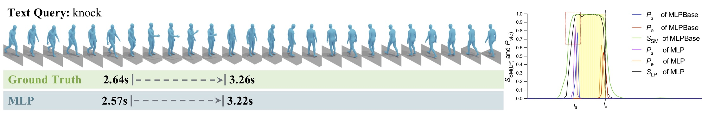

# Teslam: Temporal Sentence Localization in 3D Human Motions

## Description
Official PyTorch implementation of the paper [**"Teslam: Temporal Sentence Localization in 3D Human Motions"**](https://???)(Under review).




## Installation

<details><summary>Click to expand</summary>

### 1. Create conda environment

<details><summary>Instructions</summary>

```bash
conda create --name teslam python=3.7
conda activate teslam
```

Install [PyTorch 1.13](https://pytorch.org/) inside the conda environment, and install the following packages:

```bash
conda install ipykernel
pip install matplotlib
pip install tqdm
pip install scipy h5py coloredlogs 
pip install omegaconf
pip install hydra-core
pip install seaborn
pip install peft
pip install einops
pip install tensorboard tensorboardX tensorboard_logger
```
The code was tested on Python 3.7 and PyTorch 1.13.

</details>

### 2. Download the datasets

<details><summary>Instructions</summary>

#### BABEL dataset
> :exclamation: We cannot directly provide original data files to abide by the license.

Create this folder:
```bash
mkdir datasets/babel
```

Visit https://babel.is.tue.mpg.de/ to download BABEL dataset. At the time of experiment, we used babel_v1.0_release . BABEL dataset should be loacated at datasets/babel/babel_v1.0_release . File structures under datasets/babel/babel_v1.0_release looks like:
```
.
├── extra_train.json
├── extra_val.json
├── test.json
├── train.json
└── val.json
```

Thanks to [HumanML3D](https://github.com/EricGuo5513/HumanML3D), we adopt the same method to extract the joint information representation of the BABEL dataset. Go to the './prepare' folder and execute the scripts in the following order:

1. raw_pose_processing.ipynb
2. motion_representation.ipynb
3. cal_mean_variance.

During this process, you need to download the corresponding [AMASS](https://amass.is.tue.mpg.de/) data set to the ‘./datasets/amass_data‘ folder according to the prompts. It may take up to 2 days to complete the entire data processing
</details>

### 3. Download text model dependencies

<details><summary>Instructions</summary>

#### Download Roberta and MPNet from __Hugging Face__
```bash
cd deps/
git lfs install
git clone https://huggingface.co/roberta-base
git clone https://huggingface.co/sentence-transformers/all-mpnet-base-v2
cd ..
```

</details>
</details>

## How to train Teslam

<details><summary>Click to expand</summary>

The command to start Teslam training is as follows:
```bash
python train.py model=teslam
```
You can modify the model parameters in the 'config/model/teslam.yaml' file. When running for the first time, the .h5 file of the model input will be automatically generated, which may take 2-4 hours.

Similarly, to train Tesla, please use the following command: 

```bash
python train.py model=tesla
```

</details>

## Evaluating Teslam

<details><summary>Click to expand</summary>

Create a checkpoint folder to place pre-traine models:
```bash
mkdir ./checkpoints
```

Then, please download the pre-trained model from [here](http://???) and place it in the checkpoints folder. 

Use the following command to evaluate teslam:
```bash
python eval.py folder=./checkpoints/teslam
```

After the evaluation, some visual results will be automatically generated in the './checkpoints/teslam/qualitative' folder and top-5 './checkpoints/teslam/prediction' results in the prediction folder.

</details>


## Citation
If you find this code to be useful for your research, please consider citing.
```

```

## Acknowledgments

This code is standing on the shoulders of giants. We want to thank the following contributors that our code is based on:

[VSLNet](https://github.com/26hzhang/VSLNet), [LGI](https://github.com/JonghwanMun/LGI4temporalgrounding), [HumanML3D](https://github.com/EricGuo5513/HumanML3D), [TVR](https://github.com/jayleicn/TVRetrieval).

## License

This code is distributed under an [Apache License 2.0](http://www.apache.org/licenses/LICENSE-2.0)

